# Containerizing Web Applications on Azure App Service

Comprehensive documentation detailing the end-to-end containerization lifecycle: authoring custom Docker specifications, authenticating and publishing images to Azure Container Registry (ACR), provisioning a Linux-hosted Azure App Service environment via Visual Studio Code, and verifying runtime delivery in the Azure Portal.

---

## 1. Architecture & Provisioned Resources

### Core Infrastructure Topology

| Resource | Identifier / Name | Specification / Tier | Location |
| :--- | :--- | :--- | :--- |
| **Container Registry** | `demoregister` | Standard SKU, Admin Enabled, Login: `demoregister.azurecr.io` | South Central US |
| **Container Repository** | `dockerdemo` | Tag: `latest`, Base: `mcr.microsoft.com/appsvc/dotnetcore:lts` | South Central US |
| **App Service Plan** | `lab-11193-2297488-4925a3052` | Basic (B1: 1 Worker), Linux Operating System | East US |
| **Web App** | `lab-11193-2297488-4925a305` | Custom Container (.NET Core Runtime), Port: `8080` | East US |
| **Log Analytics** | `workspace-undefined` | PerGB2018 Data Ingestion Sink | East US |

---

### Provisioned Environment Validation

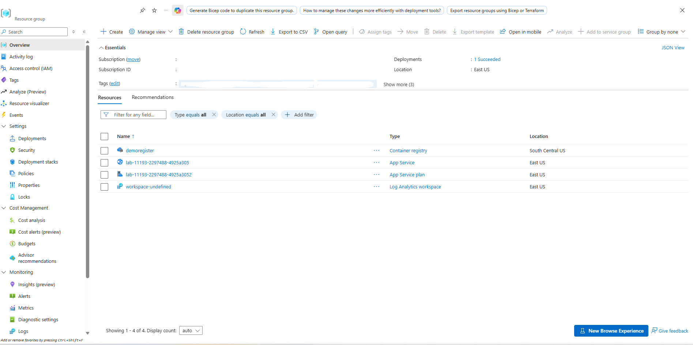

*Resource group inventory confirming deployment of the Container Registry, App Service Plan, Web App, and Log Analytics Workspace.*

---

## 2. Step-by-Step Implementation

### Step 1: Author Application Dockerfile

Defined the container runtime instructions within the project root directory, setting the base ASP.NET Core image, configuring environment variables, and declaring the network port and entry point.

* **Base Image:** `mcr.microsoft.com/appsvc/dotnetcore:lts`
* **Exposed Port:** `8080`
* **Host Binding:** `ASPNETCORE_URLS="http://*:${PORT}"`
* **Execution Command:** `ENTRYPOINT ["dotnet", "/defaulthome/hostingstart/hostingstart.dll"]`

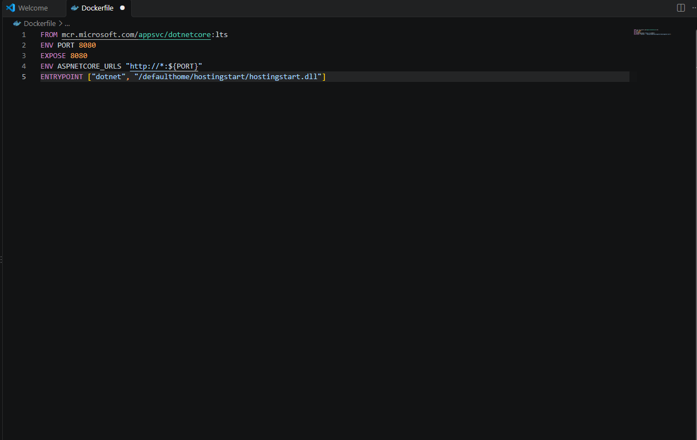

*Initial authoring of runtime requirements and environment variables within the Dockerfile.*

---

### Step 2: Configure Azure Container Registry

Validated the Azure Container Registry target instance in the Azure Portal to confirm health status, tier properties, and registry credentials before remote push operations.

* **Registry Name:** `demoregister`
* **Login Server:** `demoregister.azurecr.io`
* **Pricing Plan:** Standard
* **Provisioning State:** Succeeded

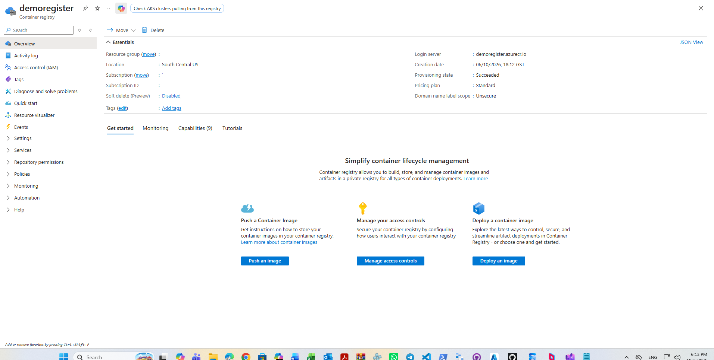

*Inspecting the essentials pane and login server endpoint for the Azure Container Registry.*

---

### Step 3: Authenticate Terminal via Docker CLI

Opened a local Git Bash shell and executed authentication against the Azure Container Registry endpoint using admin credentials to enable remote pushes.

* **Target Endpoint:** `demoregister.azurecr.io`
* **Authentication Method:** Docker CLI (`docker login`)
* **Output State:** Login Succeeded

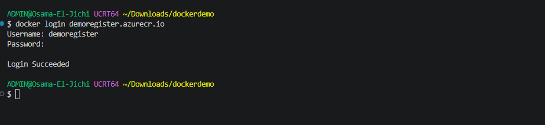

*Authenticating terminal session against the remote Azure Container Registry.*

---

### Step 4: Build and Tag Container Image

Triggered the local container build through the Visual Studio Code Docker extension, creating a container image tagged for the target remote repository.

* **Build Target:** `./Dockerfile`
* **Image Tag:** `demoregister.azurecr.io/dockerdemo:latest`
* **Workspace:** Visual Studio Code Docker Tools

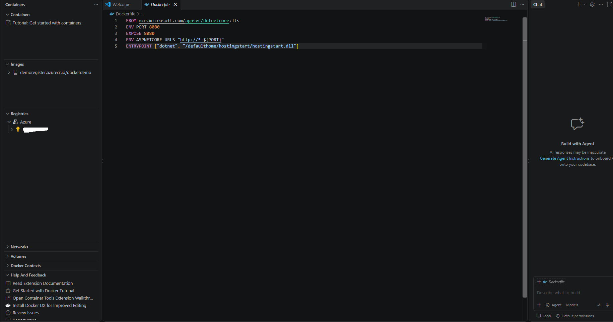

*Building the application container image using the Visual Studio Code Docker interface.*

---

### Step 5: Verify Local Container Image in Docker Desktop

Inspected the local Docker engine storage through Docker Desktop to confirm that the tagged artifact compiled cleanly and was ready for network transmission.

* **Image Repository:** `demoregister.azurecr.io/dockerdemo`
* **Tag:** `latest`
* **Image ID:** `4d0671583aee`
* **Image Size:** `1.08 GB`

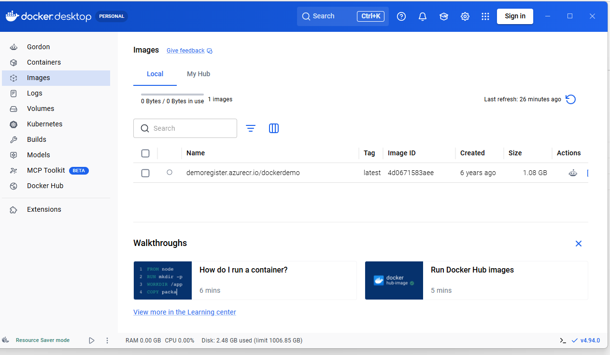

*Reviewing the compiled image details and size footprint in Docker Desktop.*

---

### Step 6: Push Container Image to Registry

Pushed the packaged container layers from the local development workstation to the remote Azure Container Registry repository via the integrated terminal and extension controls.

* **Registry Target:** `demoregister`
* **Repository:** `dockerdemo`
* **Network Protocol:** HTTPS / Docker Registry API v2

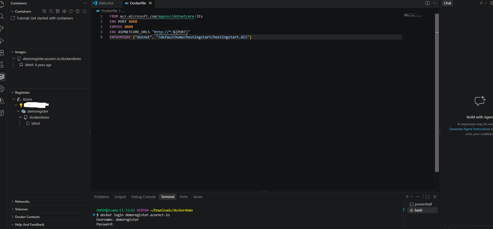

*Uploading container image layers to demoregister.azurecr.io.*

---

### Step 7: Confirm Image Ingestion in Container Registry

Navigated to the repository view of `demoregister` in the Azure Portal to verify that the image layers successfully persisted in cloud storage.

* **Registry:** `demoregister`
* **Published Repository:** `dockerdemo`
* **Tag Available:** `latest`

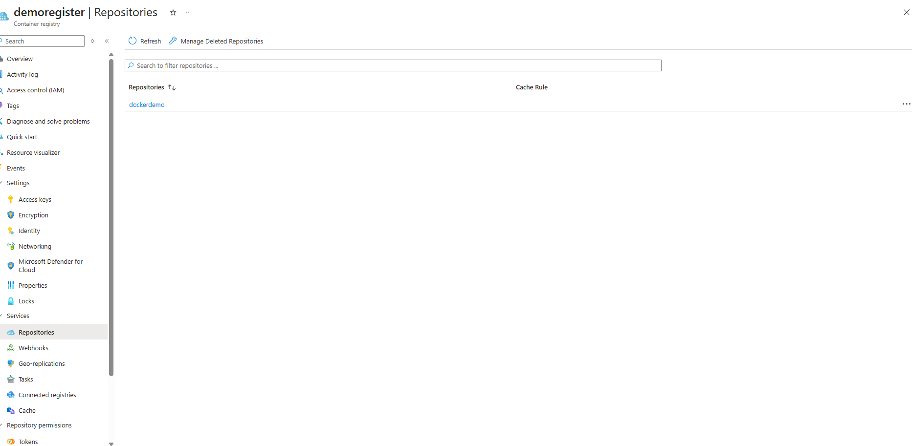

*Confirming the ingested dockerdemo repository within the Azure Container Registry repositories blade.*

---

### Step 8: Provision App Service Plan and Web App via VS Code

Used the Azure App Service extension in Visual Studio Code to provision the underlying Linux App Service plan and the containerized Web App directly from the editor.

* **App Service Plan Created:** `lab-11193-2297488-4925a3052`
* **Web App Created:** `lab-11193-2297488-4925a305`
* **Target Resource Group:** Active deployment group

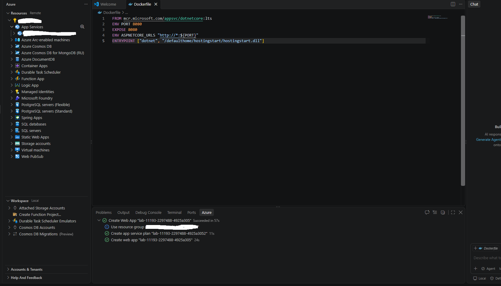

*Provisioning Azure App Service infrastructure using Visual Studio Code Azure Tools.*

---

### Step 9: Inspect Web App Configuration in Azure Portal

Reviewed the essentials pane of the provisioned Web App inside the Azure Portal to confirm runtime assignment, operational status, and compute tier binding.

* **Runtime Stack:** `Dotnetcore - 8.0`
* **Operating System:** Linux
* **Assigned Plan:** `lab-11193-2297488-4925a3052 (B1: 1)`
* **Operational Status:** Running

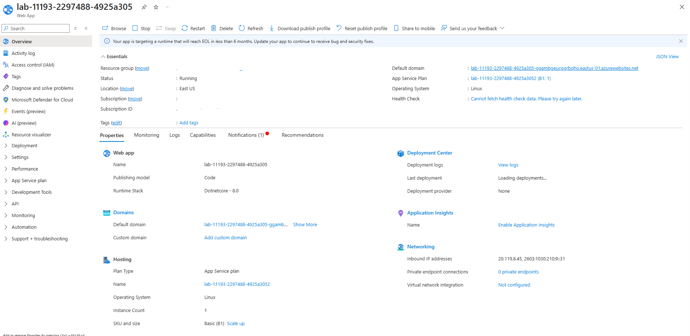

*Inspecting properties, hosting plan, and default domain configuration on the Web App.*

---

### Step 10: Validate Web Application Ingress Endpoint

Navigated to the assigned default domain in a web browser to confirm public reachability, HTTPS termination, and successful platform responsiveness.

* **Endpoint URL:** `https://lab-11193-2297488-4925a305-ggambgeucggrbqhq.eastus-01.azurewebsites.net`
* **Response:** Azure App Service Default Landing Page (.NET Runtime)

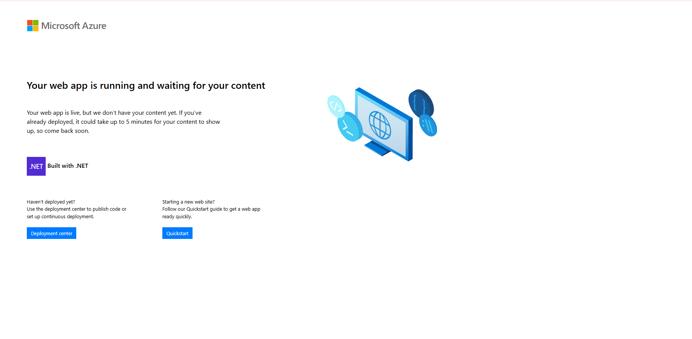

*Browser confirmation demonstrating successful HTTP response from the Azure App Service instance.*
